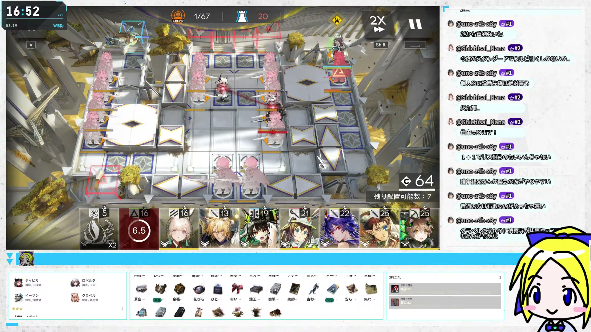
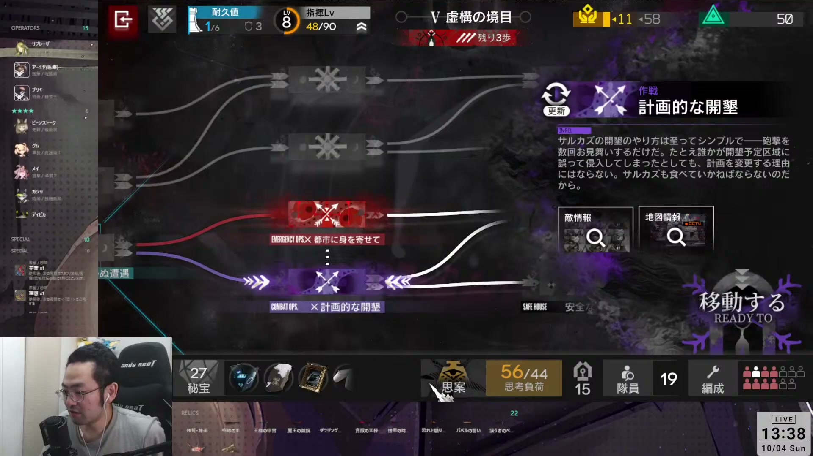
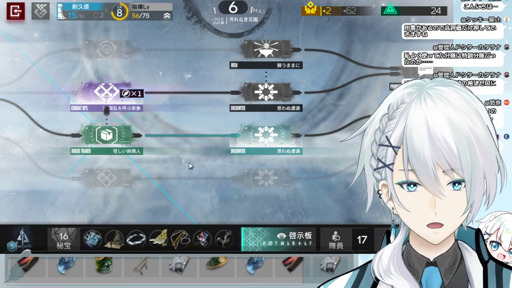
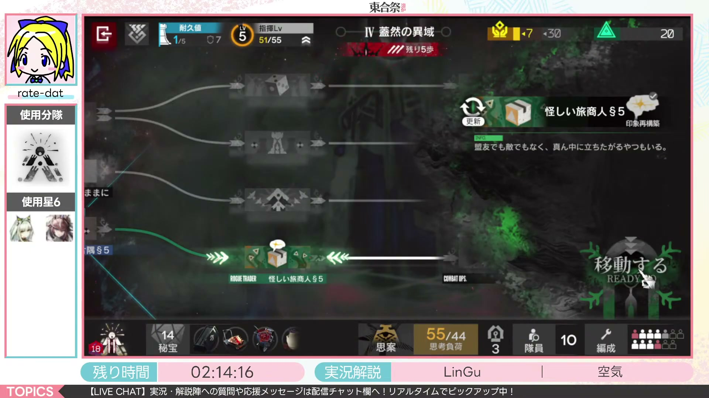
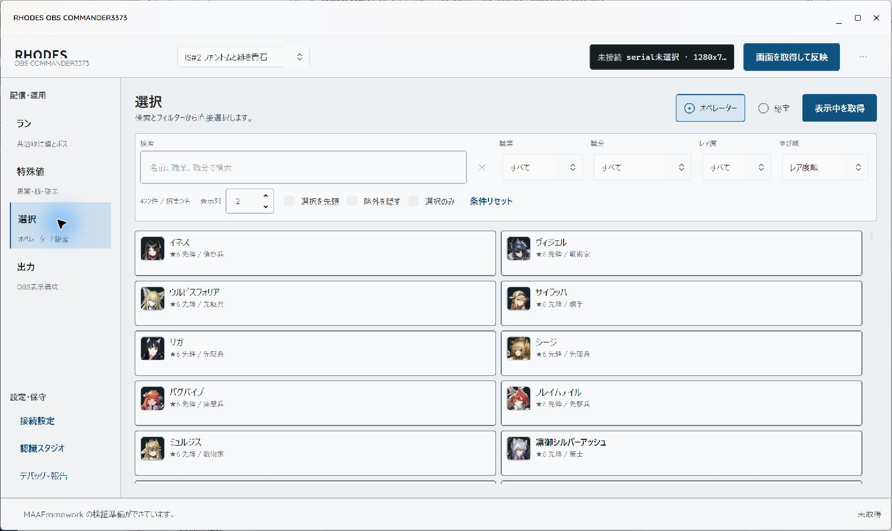

# RHODES OBS COMMANDER3373

**秘宝・オペレーター・特殊値を見やすく表示し、配信に合わせて配置や見た目を変えられます。**

アークナイツ「統合戦略」のラン情報を管理し、OBSの配信画面に表示するWindows用ツールです。 
表示枠に合わせたレスポンシブ表示に対応しています。配置はドラッグや数値指定で調整でき、見た目はCSSでカスタマイズできます。 
手動入力、画面認識による入力補助、スタッフによる遠隔入力に対応し、個人のローグ配信から大会中継まで使えます。

[できること](#できること) · [配信での使用例](#配信での使用例) · [はじめ方](docs/guides/startup-guide.md) · [CSSカスタマイズ](docs/guides/output-css-customization.md) · [配布状況](https://github.com/ratedat/RHODES-OBS-COMMANDER3373/releases)

Windows x64 · 日本版 IS#2〜IS#6 · OBSブラウザソース · AGPL-3.0-only 
開発・テスト段階／実行ファイルのGitHub Releases配布は準備中

## できること

所持秘宝や招集オペレーター、特殊値などを配信に表示できます。ゲーム画面だけでは追い切れないランの情報を、視聴者や実況・解説者も確認できます。

### 配置とサイズの調整

秘宝を画面下部、オペレーターをサイド、特殊値を見やすい場所に置くなど、情報ごとに表示位置を選べます。ゲーム画面や立ち絵、コメント欄を避けて配置できます。

- 「実出力で編集」では、OBSと同じ表示を確認しながら部品をドラッグして移動・リサイズできます。
- X・Y座標、幅・高さを数値で指定し、位置とサイズを微調整できます。部品の表示・非表示や前後関係も設定できます。
- ひとつのカスタムOverlayで画面全体を構成するほか、秘宝・オペレーターなどを個別のブラウザソースとしてOBSへ追加できます。
- 背景を透明にしてゲーム映像へ重ねたり、背景・枠を付けて配信の空きスペースに配置したりできます。

カスタム配置は1920×1080を基準に編集します。プレビューで余白や他の画面要素との位置関係を確認しながら調整できます。

### 表示枠に合わせたレスポンシブ表示

秘宝・オペレーターの一覧は、表示枠の幅に応じて列数や折り返しが変わるため、横長・縦長の枠に合わせて表示できます。枠に収まらない一覧は、自動スクロールで順に見せられます。

- 横型・縦型・コンパクトなどのレイアウトと、自由配置のカスタムOverlayを用意しています。
- 名前や情報を添える表示のほか、アイコンを中心にした省スペースな表示も選べます。
- 表示枠の大きさやスクロール速度を調整して、ゲーム画面とのバランスを取れます。

### CSSによる見た目のカスタマイズ

ユーザーCSSでフォント、文字サイズ、配色、背景の透明度、枠線、角丸、影、余白などを細かく指定し、配信のデザインに合わせて見た目を変えられます。

基本的な色や文字サイズはアプリの簡易設定から変更できます。細かく調整したい場合は、ライブCSSで出力を確認しながら編集できます。統合Overlayと個別ウィンドウのCSSは別々に設定できます。

配置はライブレイアウトで、装飾はCSSで編集します。同梱のCSSガイドにある見本や編集用プレビューを使って、配信デザインを作れます。詳しくは[CSSカスタマイズガイド](docs/guides/output-css-customization.md)をご覧ください。

### ラン情報の管理

秘宝、招集オペレーター、分隊、等級、ボス、テーマごとの特殊値をまとめて管理できます。日本版のIS#2〜IS#6に対応し、オペレーターをレア度別に表示したり、各テーマ固有の情報を配信に表示したりできます。

見せたい情報だけを選べるので、秘宝一覧を中心にしたローグ配信から、オペレーターに注目する大会配信まで、目的に合わせて構成できます。

### 手動入力と画面認識

**ゲームへ接続せず、検索・選択・数値入力だけで使い始められます。** 手動入力を基本に、必要に応じてADB・MAAFrameworkによる画面認識を入力補助として利用できます。認識結果の訂正や情報の追加も同じ操作画面から行えます。

| 使い方 | 運用例 |
| --- | --- |
| 手動入力 | 見せたい情報だけを自分で選ぶ。実況・解説担当が画面を見ながら更新する。 |
| 画面認識による入力補助 | ADB接続したゲーム画面から情報を取得し、内容を確認・修正して使う。 |
| 大会スタッフの遠隔入力 | 別の担当者がブラウザーから情報を送り、配信PCの表示を更新する。 |

### 大会スタッフによる遠隔入力

選手のランを見ながら、スタッフがブラウザー上の遠隔入力画面でオペレーター・秘宝・特殊値などを変更し、まとめて送信できます。得点やメモを表示する大会用パーツも用意しています。

小規模な運用では、アプリから入力担当者用のURLを発行する「簡易公開」を利用できます。大会ルールに合わせて表示する情報を選び、独自の配信枠と組み合わせられます。詳しい操作は[大会遠隔入力の使い方](docs/guides/tournament-remote-input.md)をご覧ください。

## 配信での使用例

配信ごとに配置や見た目を変えた使用例です。画像をクリックすると、その場面から元の配信を視聴できます。

### Rindo3373さん（サルカズの炉辺奇談）

ゲーム画面の左側にオペレーター・特殊情報、下部に秘宝を配置した例です。 
配信：[Rindo3373【アークナイツ配信他】](https://www.youtube.com/@nekomimikitunemimi) · 2026年10月4日 · [該当場面 2:00:00](https://www.youtube.com/watch?v=DWAcBQgd-Xg&t=7200s)

### 白羽 契さん（探索者と銀氷の果て）

秘宝アイコンを配信枠の下部に横並びで配置し、すっきりと見せた例です。 
配信：[白羽 契 -Shiba Chigiri-](https://www.youtube.com/@%E3%81%97%E3%81%B0%E3%81%A1%E3%81%8E%E3%82%8A) · 2026年8月2日 · [該当場面 2:00:00](https://www.youtube.com/watch?v=FRDEmZXiFWw&t=7200s)

### 東合祭でのオペレーター表示

rate-datのラン中に、使用中の星6オペレーターをひと目で確認できるよう、配信画面の左側へまとめて表示した例です。 
配信：[TOGOSEN Univ.](https://www.youtube.com/@LinGuFamily) · 2026年9月30日 · [該当場面 1:00:00](https://www.youtube.com/watch?v=o1tIQegHtwk&t=3600s)

画像は配信当時のバージョン・設定によるものです。配置や見た目はカスタマイズできます。出典と権利表記は[紹介画像について](docs/images/README.md)を参照してください。

アプリの操作画面を見る

デスクトップアプリの選択画面です。名前・職業・レア度などで絞り込み、所持状態を編集できます。

使い始めるには[入手と導入](#入手と導入)をご覧ください。出力のカスタマイズから始めたい方は[CSSカスタマイズガイド](docs/guides/output-css-customization.md)を参照してください。

## 入手と導入

現在は開発・テスト段階です。**GitHub Releasesでの実行ファイルの配布は準備中です。** 公開状況は[Releases](https://github.com/ratedat/RHODES-OBS-COMMANDER3373/releases)で案内します。

配布ZIPをお持ちの場合は、次の手順で始められます。

1. ZIPを新しいフォルダーへ**すべて展開**し、`RhodesSuki.exe` を起動します。
2. 上部で統合戦略テーマを選び、「ラン」「特殊値」「選択」で表示したい情報を入力します。
3. 「出力」で配信サーバーを起動し、**カスタムOverlay**のURLをOBSのブラウザソースへ追加します。幅1920・高さ1080が基準です。

詳しい操作、更新方法、困ったときの確認先は[はじめ方とOBS設定](docs/guides/startup-guide.md)にまとめています。

> GitHubの「Code → Download ZIP」で取得できるのはソースコードです。そのまま起動できる配布版ではありません。ソースから動かす場合は[開発環境の準備](docs/development-setup.md)を参照してください。

## 動作環境

| 用途 | 必要なもの |
| --- | --- |
| アプリの操作 | Windows x64、書き込み可能な展開先 |
| 配信画面への表示 | OBS Studioのブラウザソース、Node.js（アプリから導入可能） |
| 画面認識による入力補助 | ADB接続できるAndroid端末・エミュレーター。認識の基準は1280×720・16:9 |
| 大会の遠隔入力 | 配信PCと入力端末のインターネット接続、入力担当者用のブラウザー |

配布版にはアプリの.NET実行環境が含まれています。軽量版は、配信サーバーや大会入力に必要な追加ランタイムを初回利用時に取得します。通常の手動入力にADB接続は不要です。

## 対応する統合戦略

日本版の名称・データを使用します。テーマごとの特殊値も個別に入力・表示できます。

| テーマ | 特殊値の例 |
| --- | --- |
| IS#2 ファントムと緋き貴石 | 幻覚・演目 |
| IS#3 ミヅキと紺碧の樹 | 拒絶反応・灯火・鍵 |
| IS#4 探索者と銀氷の果て | パラダイムロスト・啓示板 |
| IS#5 サルカズの炉辺奇談 | 思案・時代・構想 |
| IS#6 歳の界園志異 | 有効銭・保有銭・遊覧券・歳時 |

## 使い方を探す

| やりたいこと | ガイド |
| --- | --- |
| 初めて起動する・OBSへ表示する | [はじめ方とOBS設定](docs/guides/startup-guide.md) |
| エミュレーターを接続して画面を読み取る | [ADB設定とトラブルシューティング](docs/guides/adb-setup.md) |
| 表示の色・文字・背景を変える | [出力のカスタマイズ](docs/guides/output-css-customization.md) |
| 大会スタッフに入力を任せる | [大会遠隔入力](docs/guides/tournament-remote-input.md) |
| 不具合を報告する・改善を提案する | [不具合報告と機能要望](docs/guides/feedback.md) |

## 現在の制限

- 認識結果には誤りや取りこぼしがあり得ます。取得後に表示内容を確認し、必要に応じて手動で訂正してください。
- **歳の銭OCR（有効銭・保有銭）は停止中です。** 銭は手動入力してください。
- 所持一覧から消えた秘宝を自動で削除する機能は未対応です。
- ゲーム内の操作だけで新しいランを始めた場合、その開始を確実に自動判定する機能は未対応です。新しいランではアプリ側の「ランをクリア」も使用してください。
- 大会入力の簡易公開URLは、公開を停止するか、アプリを終了すると使えなくなります。継続運用する大会では、事前に接続と表示を確認してください。

## 開発・協力

<table>
<tr>
<td></td>
<td>
本ツールはrate-datが中心となって開発しています。  
<a href="https://x.com/rate_dat">X（Twitter）</a> · <a href="https://www.youtube.com/@rate-dat">YouTube</a>
</td>
</tr>
</table>

不具合報告、説明の改善、機能の提案も歓迎します。[Issues](https://github.com/ratedat/RHODES-OBS-COMMANDER3373/issues)で受け付けています。

コードやデータの変更に参加する方は[貢献ガイド](CONTRIBUTING.md)、[開発環境の準備](docs/development-setup.md)、[検証手順](docs/development-verification.md)をご覧ください。構成・認識・データ関連の資料は[資料一覧](docs/README.md)から参照できます。

## 謝辞・ライセンス

画面認識には[MAAFramework](https://github.com/MaaXYZ/MaaFramework)、デスクトップUIには[Avalonia](https://github.com/AvaloniaUI/Avalonia)と[SukiUI](https://github.com/kikipoulet/SukiUI)を使用しています。[MaaAssistantArknights](https://github.com/MaaAssistantArknights/MaaAssistantArknights)をはじめとする関連プロジェクトと、データ・素材の提供元に感謝します。

アプリのソースコードは[AGPL-3.0-only](LICENSE)で公開しています。素材・依存ライブラリの出典とライセンスは[第三者表記](THIRD_PARTY_NOTICES.md)および[ライセンスについて](docs/legal/licenses.md)を参照してください。

本ツールはアークナイツの非公式ファンツールです。ゲーム内の名称・画像等の権利は各権利者に帰属します。
